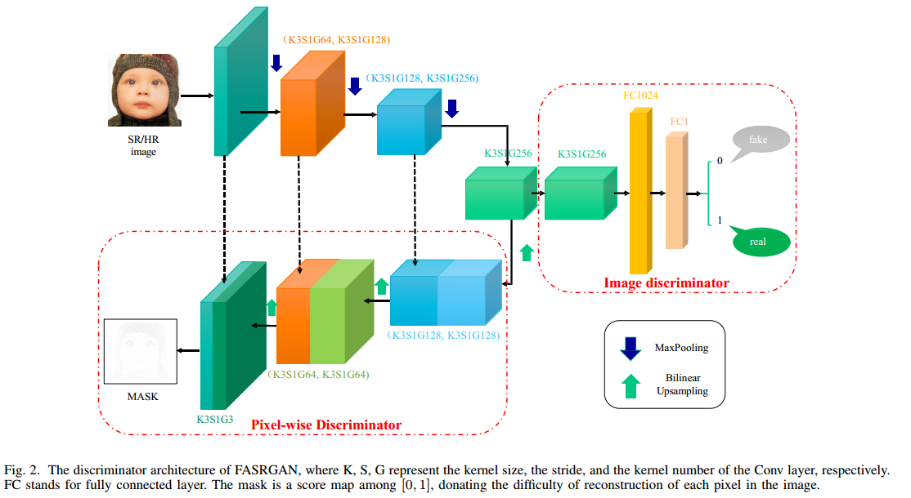
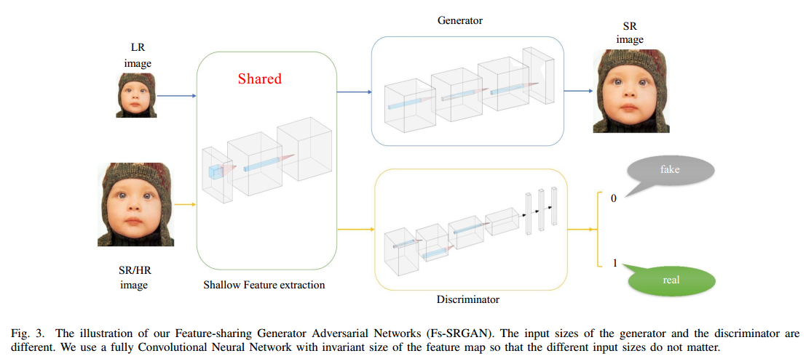
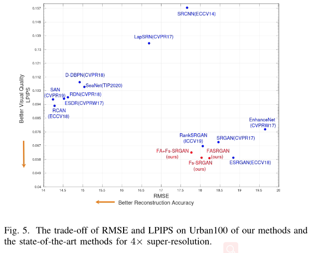
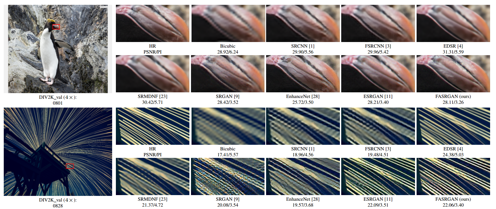
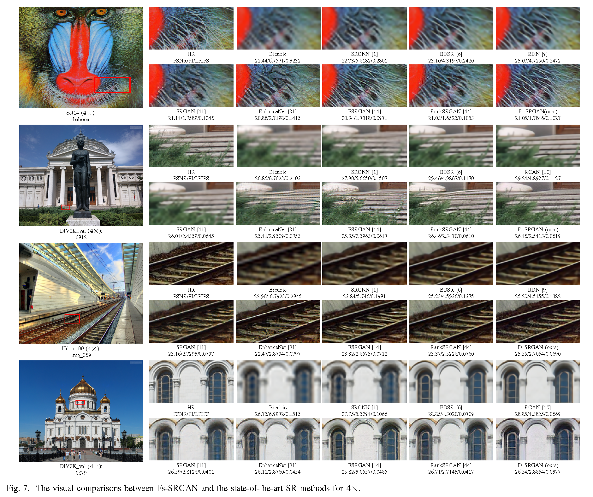
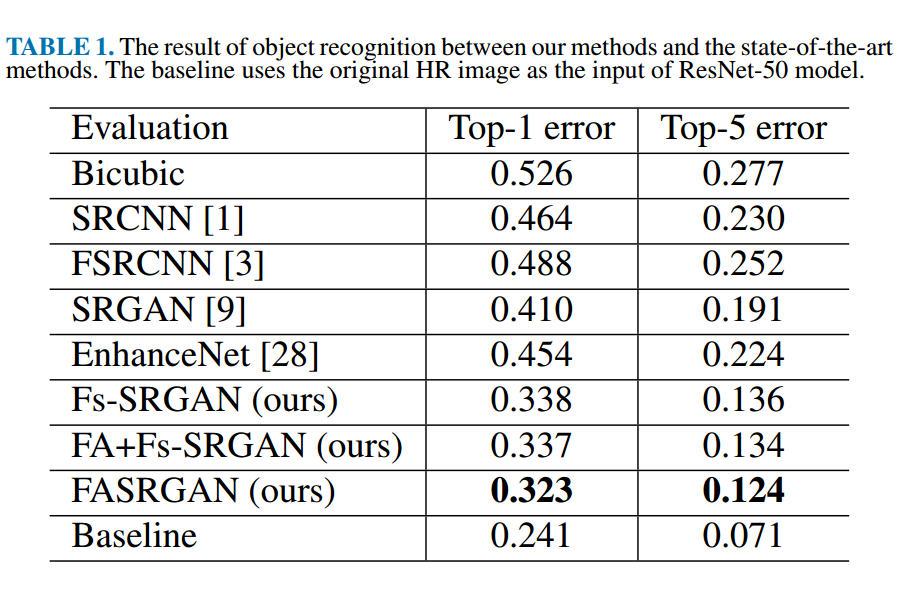

# Fine-grained Attention and Feature-sharing Generative Adversarial Networks for Single Image Super-Resolution
This [Paper](https://arxiv.org/abs/1911.10773) has been accepted for publication on IEEE Transaction on Multi-media. 

## Contents
1. [Proposed Methods](#Proposed-Methods)
2. [Results and codes](#Results-and-codes)
3. [Experiment comparisons](#Experiment-comparisons)


## 1.Proposed Methods
We propose two novel techniques in the generative adversarial networks to produce photo-realistic images for image super-resolution in this paper. 
### FASRGAN
Instead of producing a single score to discriminate images between real and fake, we propose a variant, called Fine-grained Attention Generative Adversarial Network for image super-resolution (FASRGAN), to discriminate each pixel between real and fake.  

### Fs-SRGAN
Instead of using different networks for the generator and the discriminator in the SR problem, we use a feature-sharing network (Fs-SRGAN) for both the generator and the discriminator. 


## 2.Results and codes

### How the evaluate the results
We evaluated our methods on several datasets in terms of PSNR/SSIM/PI/LPIPS, where PSNR/SSIM are used to evaluation the accuracy of SR images, and PI/LPIPS are adopted to evaluate the perceptual quality.
Perceptual Index (PI) is used in The PIRM Challenge on Perceptual Super-Resolution, and Learned Perceptual Image Patch Similarity (LPIPS) metric is proposed in the work "The Unreasonable Effectiveness of Deep Features as a Perceptual Metric", which evaluates the distance between image patches. Both of them with lower value means more similar. 

You can use the codes in Test_scripts to calculate the PSNR/SSIM/PI/LPIPS: 
1. Download the results of our methods at [Baidu Netdisk](https://pan.baidu.com/s/19X15RgbF0DIvkTBokx603w) (code: 6q7p) or [Google drive](https://drive.google.com/open?id=12286mQ-Lq_4HoGPdsMQk2F9DmmnAQAv8).
2. Move these Results into the 'Test_scripts/Results' folder.
3. Run the scripts in Test_scripts for testing.

### Source code and models
The codes of model are defined in /codes/models. 

And the pre-trained models can be downloaded from  [Baidu Netdisk](https://pan.baidu.com/s/1gIUYaDXBRY1IA5WJ2f8Otg) (code: 723l) or [Google drive](https://drive.google.com/file/d/1LodToiw66jVR-QSsWwgjYzE7PEMUMkAj/view?usp=sharing).

### How to train
python train.py -opt /options/train/train_FASRGAN.json
python train.py -opt /options/train/train_FsSRGAN.json

### How to test
python test.py -opt /options/test/test_FASRGAN.json
python test.py -opt /options/test/test_FsSRGAN.json

<!-- ### Pre-trained models
Download the results of our methods at [Baidu Netdisk](https://pan.baidu.com/s/16XF1_-DsWv9r6qbm-cE9mw) or [Google drive](https://drive.google.com/drive/folders/1OVFJAa89SKt-wfMqpGPiNW2E3qN55tc1?usp=sharing)). -->

## 3.Experiment comparisons
### Quantitative results with the bicubic degradation model. best and second best results are highlighted and underlined, respectively.


### The trade-off of RMSE and LPIPS on Urban100 of our methods and the state-of-the-art methods for $4\times$ super-resolution



###  Qualitative comparisons of FASRGAN on benchmark datasets between our methods and state-of-the-art methods




### Qualitative comparisons of Fs-SRGAN on benchmark datasets between our methods and state-of-the-art methods




### Object Recognition Performance of resnet-50 between our methods and state-of-the-art methods



## Citation
If you find this repository useful for your research, please use the following.
```
  @ARTICLE{9377002,  author={Y. {Yan} and C. {Liu} and C. {Chen} and X. {Sun} and L. {Jin} and P. {Xinyi} and X. {Zhou}},  journal={IEEE Transactions on Multimedia},   title={Fine-grained Attention and Feature-sharing Generative Adversarial Networks for Single Image Super-Resolution},   year={2021},  volume={},  number={},  pages={1-1},  doi={10.1109/TMM.2021.3065731}}
```

## Acknowledgements
The repository is built on the [BasicSR](https://github.com/xinntao/BasicSR) repository.
