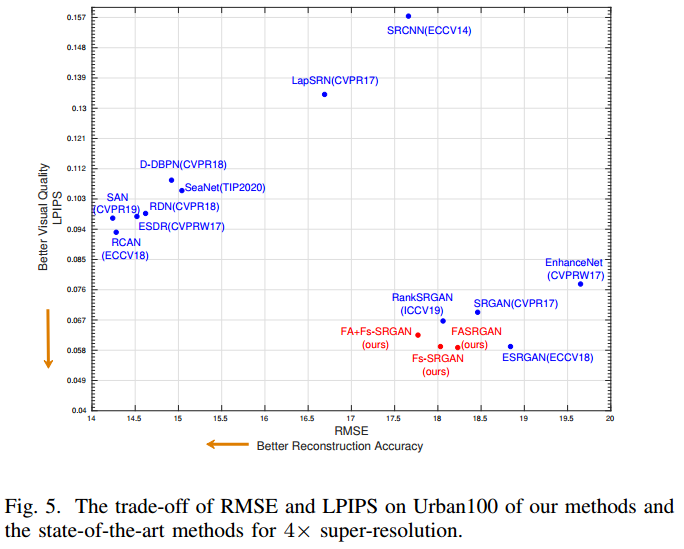
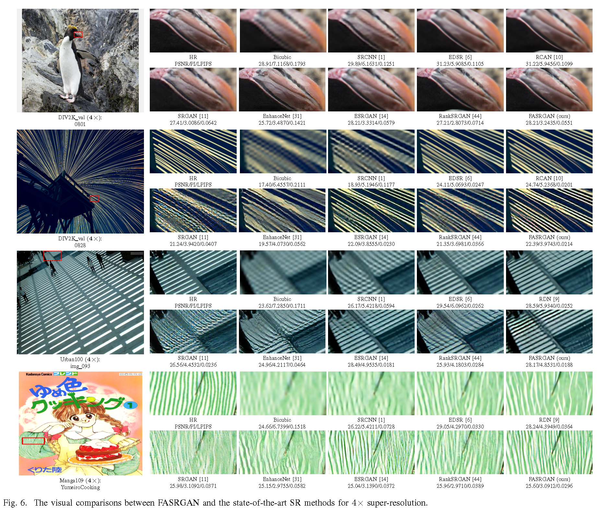
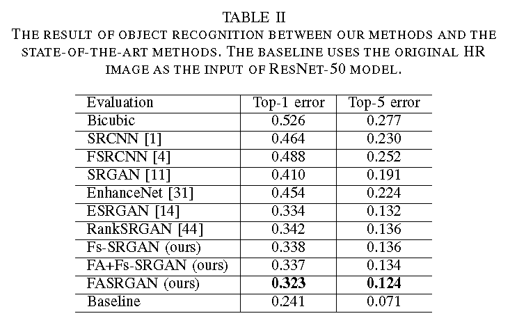

# Fine-grained Attention and Feature-sharing Generative Adversarial Networksfor Single Image Super-Resolution
## Contents
1. [Proposed Methods](#1.Proposed-Methods) 
2. [Results and codes](#2.Results-and-codes) 
3. [Experiment comparisons](#3.Experiment-comparisons) 

## 1.Proposed Methods
We propose two novel techniques in the generative adversarial networks to produce photo-realistic images for image super-resolution. 
### FASRGAN
Instead of producing a single score to discriminate images between real and fake, we propose a variant, called Fine-grained Attention Generative Adversarial Network for image super-resolution (FASRGAN), to discriminate each pixel between real and fake.  

### Fs-SRGAN
Instead of using different networks for the generator and the discriminator in the SR problem, we use a feature-sharing network (Fs-SRGAN) for both the generator and the discriminator. 

## 2.Results and codes

### How the evaluate the results
We evaluated our methods on several datasets in terms of PSNR/SSIM/PI/LPIPS, where PSNR/SSIM are used to evaluation the accuracy of SR images, and PI/LPIPS are adopted to evaluate the perceptual quality.
Perceptual Index (PI) is used in The PIRM Challenge on Perceptual Super-Resolution, and Learned Perceptual Image Patch Similarity (LPIPS) metric is proposed in the work, The Unreasonable Effectiveness of Deep Features as a Perceptual Metric, evaluating the distance between image patches. Both of them with lower value means more similar. 

You can use the codes in Test_scripts to calculate the PSNR/SSIM/PI/LPIPS: 
1. Download the results of our methods at [Baidu Netdisk](https://pan.baidu.com/s/19X15RgbF0DIvkTBokx603w) (code: 6q7p) or [Google drive](https://drive.google.com/open?id=12286mQ-Lq_4HoGPdsMQk2F9DmmnAQAv8).
2. Move these Results into the 'Test_scripts/Results' folder.
3. Run the scripts in Test_scripts for testing.

### Source code and models
The codes and pre-trained models will be released upon the acceptance of the paper.

<!-- ### Pre-trained models
Download the results of our methods at [Baidu Netdisk](https://pan.baidu.com/s/16XF1_-DsWv9r6qbm-cE9mw) or [Google drive](https://drive.google.com/drive/folders/1OVFJAa89SKt-wfMqpGPiNW2E3qN55tc1?usp=sharing)). -->

## 3.Experiment comparisons
### Quantitative results with the bicubic degradation model. best and second best results are highlighted and underlined, respectively.

### The trade-off of RMSE and LPIPS on Urban100 of our methods and the state-of-the-art methods for $4\times$ super-resolution

###  Qualitative comparisons of FASRGAN on benchmark datasets between our methods and state-of-the-art methods

### Qualitative comparisons of Fs-SRGAN on benchmark datasets between our methods and state-of-the-art methods

### Object Recognition Performance of resnet-50 between our methods and state-of-the-art methods

